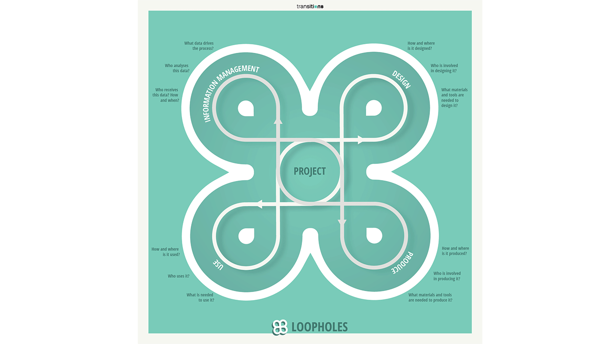
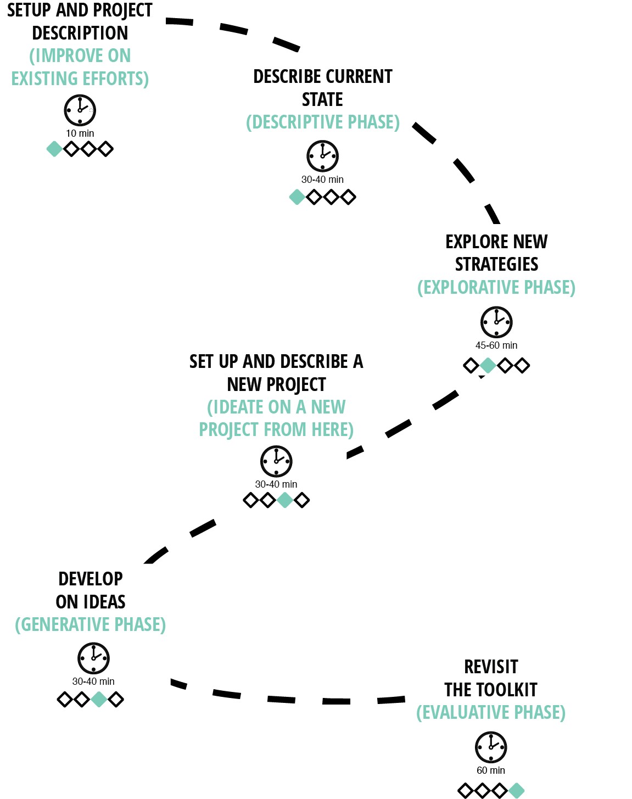

---
# Feel free to add content and custom Front Matter to this file.
# To modify the layout, see https://jekyllrb.com/docs/themes/#overriding-theme-defaults

layout: home
---
# Welcome to the Loopholes Toolkit, 
## a fusion of strategy and serious design thinking.

 
 
Centered around a collaborative design process, the Loopholes toolkit empowers stakeholders to craft comprehensive user journeys and data flows, paving the way for future production systems with sustainability and technology in mind. It encourages reflection on current company processes and their expansion into product-service ecosystems and ecologies. Each toolkit iteration fosters localized strategies for transitioning towards circularity through digitalization.

The toolkit is catered for anyone looking to strategize on evaluating their current position in sustainability and tech innovation, wanting to improve current practices, or develop potential ideas to cater to the ever-changing future.

## Dive into Design Thinking with the Loopholes Toolkit: Embrace Divergent and Convergent Methods!

 
The toolkit begins by helping you map the current state of your company or project. This brings the team to a consensus on the purpose and goals of the company which sets the stage for effective collaboration and meaningful outcomes.

 
For companies already engaged in existing work and seeking to strategize on future transitions, the next phase guides the team through a detailed <strong> description </strong> of efforts within the complete product-service ecosystem. It identifies ongoing initiatives, assesses their impact across various facets of the company, and offers an overview of whether these efforts are contributing to the shared vision.

This deep-dive then transitions into an <strong> explorative </strong> phase focused on charting the company's path forward. New ideas are seamlessly integrated to build upon existing efforts and lay a roadmap toward a sustainable and innovative future through tangible and time-bound efforts. 

For teams exploring a potential new project or starting from a clean slate, the toolkit offers an opportunity to ideate afresh. Utilizing cards and thoughtful questions, this phase assists in defining a new project from the ground up.

Such teams can further develop ideas on how to <strong> generate </strong> concepts that transform their vision into a tangible product-service ecosystem. The canvases prompt questions that guide the team to break down their project vision into practical efforts, encouraging consideration of different perspectives throughout the process.

While using the toolkit for exploration and idea generation is exciting, there is value in periodically revisiting these efforts to ensure that ideas and plans are progressing as intended. Emphasizing the iterative approach of this toolkit iteration, the final and crucial phase allows users to <strong> evaluate </strong> and refine their efforts based on on-ground feedback.

This approach empowers teams to innovate continuously, adapting and refining strategies to align with evolving business needs and market dynamics. Additionally, the toolkit provides a series of indications on policy considerations, ensuring that users are aware of and work towards complying with EU regulations due in the next few years.

# Get Started with Our Toolkit: Download Now or Contact Us for More Information!
If this has piqued your interest, download the toolkit and its components to try it yourself, or contact [___] for more information.

[Download the toolkit and its components](https://github.com/troykyo/dssloopholes.github.io/raw/main/assets/Links.zip)

<!-- # About the Loopholes Toolkit

Welcome to the Loopholes Toolkit, a fusion of strategy and serious design thinking.

Centered around a collaborative design process, the Loopholes toolkit empowers stakeholders to craft comprehensive user journeys and data flows, paving the way for future production systems with sustainability and technology in mind. It encourages reflection on current company processes and their expansion into product-service ecosystems and ecologies. Each toolkit iteration fosters localized strategies for transitioning towards circularity through digitalization.

The toolkit is catered for anyone looking to strategize on evaluating their current position in sustainability and tech innovation, wanting to improve current practices, or develop potential ideas to cater to the ever-changing future.

The design process involves a board, a deck of strategy cards, and an expansive content website. Here, you'll find in-depth information on each strategy from the Loopholes card deck, complemented by applicable case studies.

# The Loopholes Toolkit Experience

The Loopholes Toolkit offers an engaging, hands-on experience with a physical board tailored for corporate use. It guides stakeholders through the complexities of integrating new technologies into circular business models.

# How It Works

Stakeholders begin by selecting a target product or service and setting a developmental timeline. The board leads them through the various phases and challenges of developing a circular business.

The toolkit's strategy cards provide educational insights and prompts for each board quadrant, fostering critical thinking and strategic planning. This enhances stakeholders' comprehension of technology's role in their offerings.

# Expected Outcomes

Engagement with the Loopholes Toolkit equips stakeholders to:

## Understand Ideal Dataflow Holistically
Participants gain a robust understanding of the dataflow supporting circular business models, enabling optimization of data practices and the identification of improvement areas.

## Identify Critical Data Gaps
Trigger cards reveal essential, yet absent, data, aiding stakeholders in making informed decisions and improving operational efficiency.

## Develop a Strategic Roadmap
Insights gleaned from the toolkit help draft a strategic roadmap for new technology adoption and effective data utilization, clarifying the path to augmenting their business model.

## Foster Collaboration and Team Dynamics
The toolkit is designed for team interaction, which bolsters collaborative skills and problem-solving abilities, vital for organizational cooperation.

## Drive Innovation and Creativity
The toolkit's thought-provoking nature encourages stakeholders to innovate, leading to unique solutions for circular business models.

These outcomes provide a competitive advantage in the shift towards a circular economy, leveraging data and technology for sustainable, environmentally-conscious growth.

# Join the Circular Business Revolution

The Loopholes Toolkit delivers dynamic, transformative experiences for any company, big or small, keen on embracing circularity and digitalization. Embark on this journey with us and unlock innovative, sustainable growth opportunities. -->
